
## Plan of Attack

+ Research Motivation
+ Operating Context
+ TELs in Colorado
  + Why study the local impact of TELs?
  + Does TABOR capture TEL structure in Colorado?
  + How can we explore spatial clustering?
  + How can we explore the impact of TEL intensity?
  + What have we learned?
+ Chasing Voter Preferences

--- .class #id 

## Intergovernmental Linkages Seems a Little Wide Open

+ There are ~90,150 jurisdictions in the US ([Census, 2012](http://www2.census.gov/govs/cog/g12_org.pdf))
+ Unintended consequences are more likely than not
+ Research Goals:
  + Explore the fundamental hierarchy that governs the system
  + Explore the implications of spatial variation and dependency
  + Pay homage (hat tip to Daniel Mullins)
+ Spanish:English -> Spatial:Temporal
+ This study is about state policy applied to local governments
+ (Reasonably) Exogenous shift for counties of varying circumstance

---

## Leveraging a Captive Audience

+ Research activity = $f$(Own Interest, Academic/Professional Circumstance)
+ Research inertia is real, but conduct of inquiry is general
+ Utility role in ORA
+ Open-Source Ecosystem

---

## General Mechanism

1. TELs impose artificial barriers in the fiscal matching process
2. Revenue growth that lags expenditure need decreases the achievable investment in human and physical capital
3. Lower capital investment diminishes the attractiveness of a jurisdiction for businesses and, in turn, residents

To the extent that recessions facilitate 'ratcheting', the dynamic impact of recessionary years in non-trivial.  

Can TELs impact broad trends in fiscal and economic capacity?

---

## TEL Literature Landscape

Most of the empirical work attempts to study TELs across states, and as such, focuses on statewide definitions of TELs. Obviously this covers up local variation, but perhaps more interestingly, this choice in geographic scope encourages certain types of questions. 

+ What is the impact of TELs on revenue volatility ([St. Clair 2012](http://papers.ssrn.com/sol3/papers.cfm?abstract_id=2151690))? 
+ Do TELs constrain property taxes ([Dye & McGuire 1997](http://www.sciencedirect.com/science/article/pii/S0047272797000479))? 
+ Do TELs constrain growth in employment and wages ([Poterba & Rueben 1995](http://www.jstor.org/discover/10.2307/2117953?uid=3739256&uid=2&uid=4&sid=21102688756161))?
+ Does the impact of TELs on property revenue change during recessions (Mullins & Mikesell 2013)?

Evaluating the impact of TELs with a local lens begs the question, *are some jurisdictions affected differently than others*? While St. Clair did utilize local government data, the purpose was to show a general effect.  [Mullins (2004)](http://onlinelibrary.wiley.com/doi/10.1111/j.0275-1100.2004.00350.x/abstract?deniedAccessCustomisedMessage=&userIsAuthenticated=false), by contrast, is an important example of evaluating the *differential* impact of TELs as a function of socioeconomic starting conditions.

This study seeks to extend this approach by incorporating spatial and temporal dependency.

---

## Why Colorado?

+ Variation, variation, variation
  + Widely regarded as having one of the most restrictive TEL regimes in the country
  + Policy overlap is a significant feature
  + "De-Brucing" is a double edged sword

  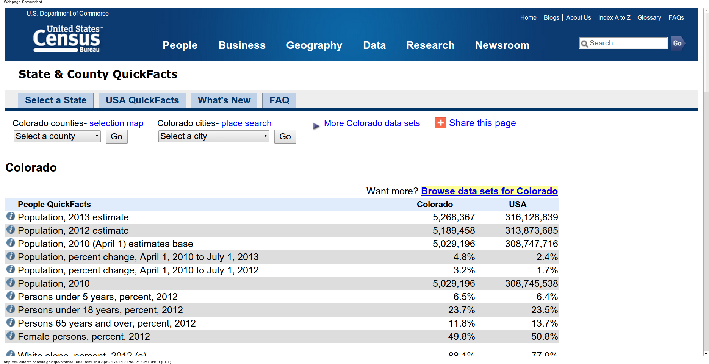

---

---

## TABOR *And Company*

While the Taxpayer's Bill of Rights (TABOR) gets the lion's share of attention in Colorado, it is but one component of a set of four overlapping policies.  In order of enactment:

1. **General Statewide Limit on Property Tax Revenue (SLPTR):**  Local property tax revenues may not increase by more than 5.5% in a given year (the limit was 7% before 1988)
2. **Gallagher Amendment (GA):** Assessment rates for residential property are set statewide, calculated to keep historical ratios of residential and non-residential property tax revenue consistent (with some minor space for modification)
3. **Taxpayer Bill of Rights (TABOR):** Limits annual growth in revenues to inflation plus a measure of growth (new construction for local governments and enrollment for school districts)
4. **Amendment 23 (A23):** Mandates minimum increases in school funding and removes a portion of revenue from the TABOR base

Yes, the interactions create modeling difficulties, but they also happen to provide *temporal variation* in the restrictiveness of the TEL structure.

---

## And De-Brucing is ...?

Local governments reserve the right to waive the requirements of both TABOR and the SLPTR.  Over the 1993-2011 period, 48 counties chose to exempt themselves from one or both restrictions.  This has provided *cross-sectional variation* ... and methodological complexity. 

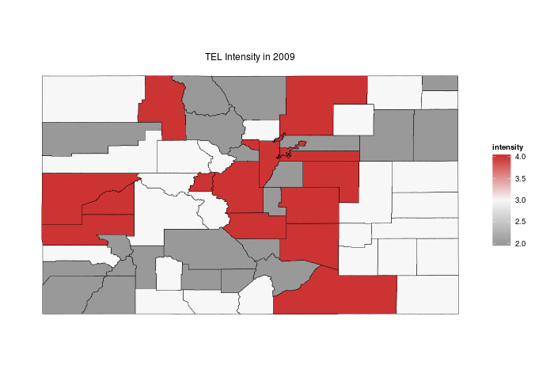

---

## Don't Empirical Inquiries Have Tests?

1. Spatial Dependency (H1): TELs increase clustering in fiscal and economic activity
2. Revenue Generation (H2): TELs depress revenue yield
3. Revenue Capacity (H3):  TELs depress economic output (exploratory)

---

## How Do We Account for Variation in Impact?

The preliminary ordinal measure implicitly assumed equivalency in impact across all counties, and varied too little over time.  In so doing it diminished the value add of this approach.  An ideal intensity score would capture three characteristics of any given county at time $t$:

1. The cumulative impact of statewide legislation over time;
2. The proliferation of locally derived exemptions from TABOR and SLPTR; and,
3. The local economic dynamics that may trigger a breach in the ceilings imposed by the aforementioned legislation.

This requires abstraction to modeling the implications of policy rather than the policy itself.  An estimate of the gap between revenue potential and the revenue yield permitted by the policies acting on county $i$ at time $t$ satisfies these requirements with a *continuous* measure.

---

## Empirical Justification for the Measure

  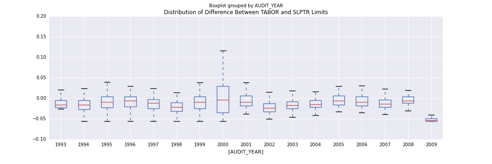

  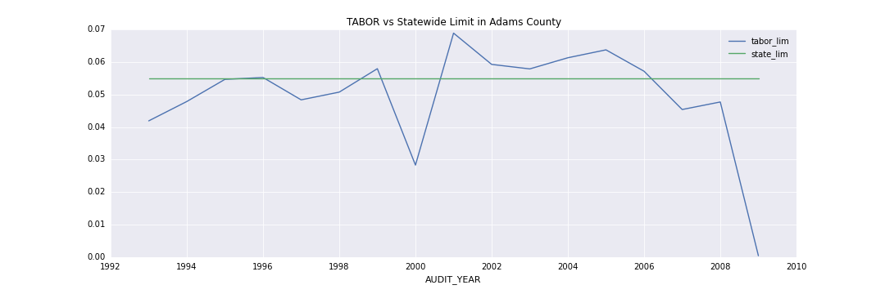

---

## Modeling the Gallagher Amendment

Insofar as it is a limit based upon statewide characteristics, the Gallagher Amendment is a different animal altogether.  It is modeled as a separate variable.

  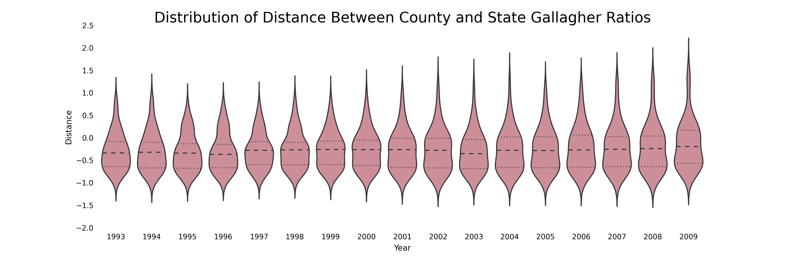

To the extent that the residential share in a given county is higher than the statewide average, that county is constrained below its property tax revenue potential.

---

## Spatial Considerations

Industrial bases and socioeconomic conditions do not abruptly shift out of respect for the county border.  Counties can and do share similarities with their neighbors.  Spatial autocorrelation is real.  Enter Local Indicators of Spatial Association (LISAs; [Anselin 1995](http://onlinelibrary.wiley.com/doi/10.1111/j.1538-4632.1995.tb00338.x/abstract)):

#### Local Moran's $I_i$

$$I_i=\frac{\sum_j z_i w_{i,j} z_j}{\sum_i z_i^2}=\frac{\sum_j (y_i-\bar y)w_{i,j}(y_j-\bar y)}{\sum_i(y_i-\bar y)^2}$$

#### Getis & Ord's $G_i$

$$G_i(d)=\frac{\sum_j w_{i,j} (d) y_j - W_i \bar y(i)}{s(i)\{[(n-1) S_{1i} - W_i^2]/(n-2)\}^{(1/2)}},j \neq i$$

--- 

## Spatial Autocorrelation vs Temporal Autocorrelation

Temporal autocorrelation is often spoken of in terms of process memory.  The observation in time $t$ will exhibit a given relationship with the observation in time $t-1$ because the DGP carries the latent effect of that previous observation.  It "remembers" the last value or values, and behaves in a manner consistent with that knowledge.  

  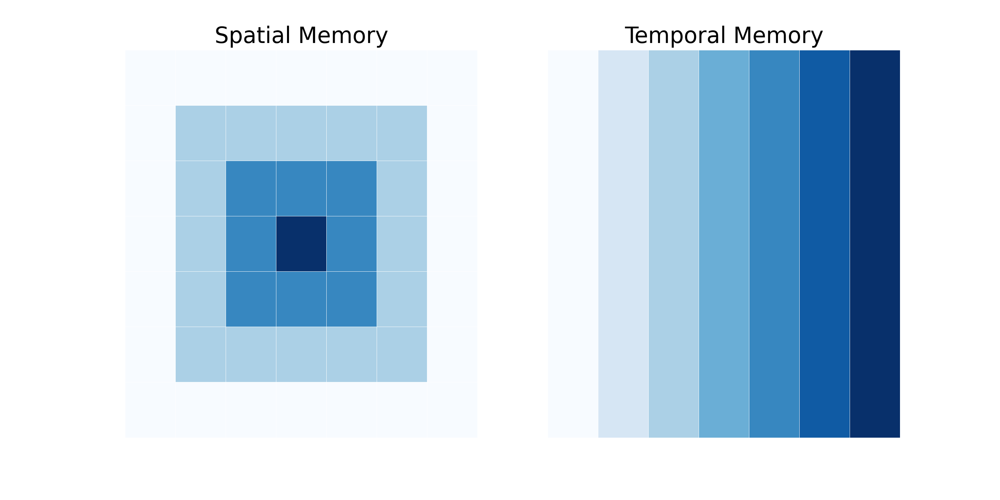

Spatial autocorrelation, insofar as it incorporates information about observations in the local neighborhood, is basically doing the same thing.  The difference is that temporal autocorrelation reflects uni-directional memory, while spatial autocorrelation reflects multi-dimensional memory.  

---

## Unpacking Measures of Spatial Autocorrelation

Local Moran's I and Getis & Ord's G* are complementary measures, insofar as they measure two different types of clustering.  Local Moran's I highlights pockets of similarity and disimilarity while Getis & Ord's G* highlight pockets of high and low values.

  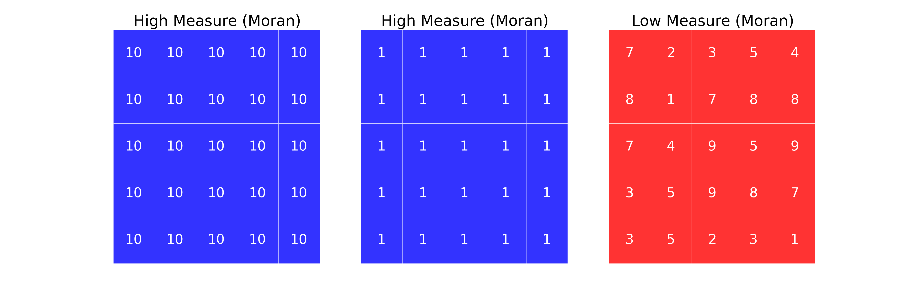

  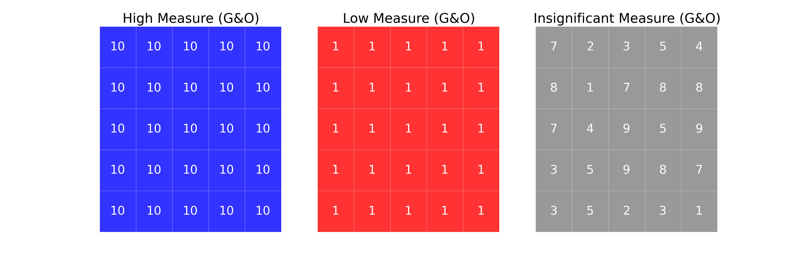

---

## What is the Local Neighborhood?

Defining the local neighborhood is somewhat analagous to defining the memory structure in an autoregressive process.

>"[W]hile there have been significant advances in the spatial econometrics literature in the last 20 years, the key issue involved from the very start (the specification of the W-matrix and the form of spatial spillovers more generally) remains largely unsolved." ([Harris & Kravtsova 2009](http://www.ub.edu/sea2009.com/Papers/100.pdf))

>"...what is the theoretical and empirical basis of assumptions about the spatial reach of externalities, and how can this be enhanced?" ([Fingleton 2003](http://irx.sagepub.com/content/26/2/197.abstract))

---

## Practical Choices

There are a number of simple definitions utilized by practitioners.  In the evaluation of the LISAs, I used two broad classes:

1. Contiguity-Based (Rook, Queen)
2. Distance-Based (Binary, Linear, Kernel)

  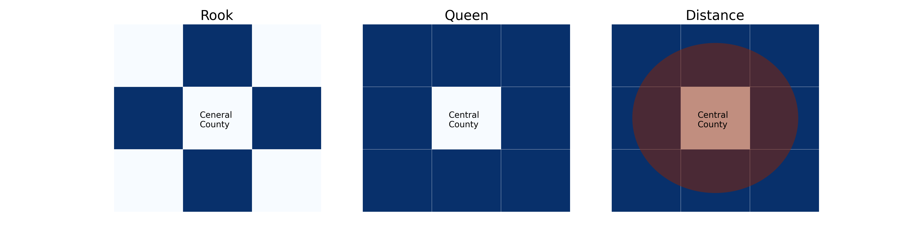

  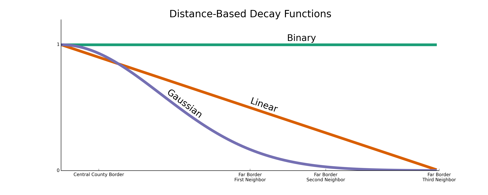

---

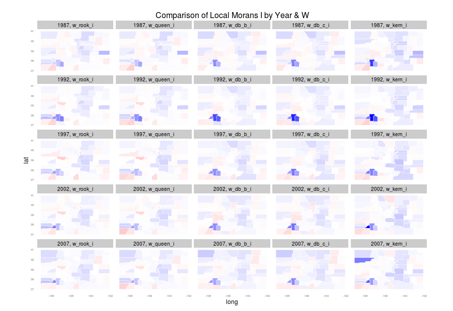

---

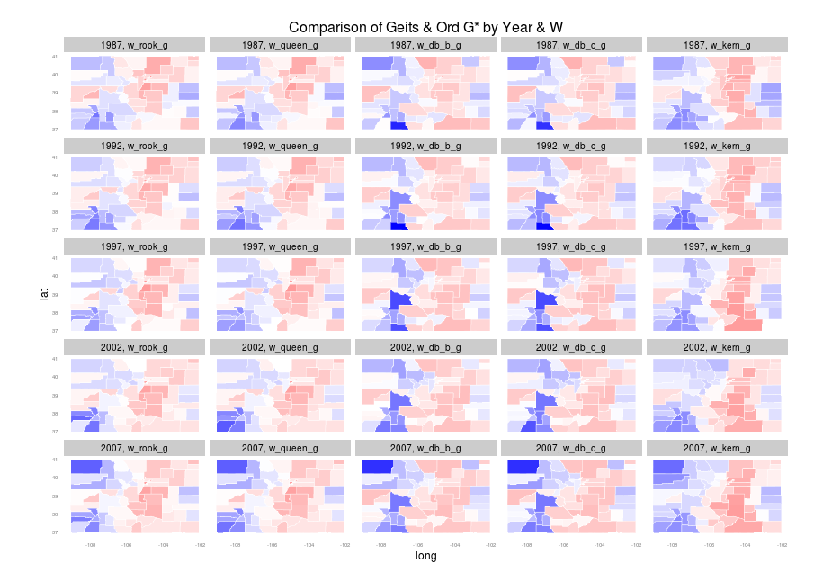

---

  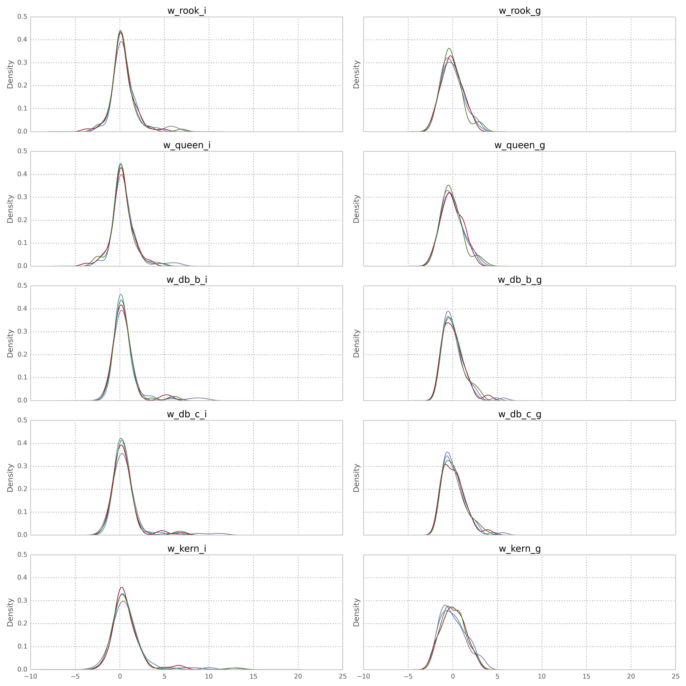

---

## Diving Deeper into LISAs

1. Variation is substantially higher in Getis & Ord's G* than in Local Moran's I.  This suggests that clustering is relatively persistent, with larger variation in the magnitude of the clustered values.
2. Variation is higher as magnitude increases for both statistics.  For Local Moran's I, the variation we do see occurs most often amongst similar values.  For Getis & Ord's G*, this indicates that low revenue counties are more tightly coupled than high revenue counties.
3. Central tendency generally leans right of zero for Local Moran's I and left for Getis & Ord's G*.  This reinforces the idea that clustering tends to be present and stronger amongst low revenue counties.

---

## Estimation of TEL impact

We will view two separate specifications.  The first specification comes from some of the work in the paper, while the second reflects a more panel-centric update.

### Specification 1 (Used in pooled OLS and repeated cross-sections)

`pcrev/pcap/LISA` = $f$(`gsp,lpop_growth,st_unempr,permit_rate,vac_rate,prop_ratio,intensity_stock`)

### Specification 2 (Used in spatial panels)

`log(pcrev/pcap)` = $f$(`pop,unemp_rate,vac_rate,rel_prop_ratio,intensity_stock,[as.factor(pcap_q)]`)

---

## Econometric Exploration

$\bf{\text{Ordinary Least Squares}}$ - OLS will serve as a non-spatial pooled estimate

   $$y=X\beta+\epsilon$$

$\bf{\text{Spatial Error Model}}$ - Error term in this model seeks to mitigate spatial dependency across counties

   $$y=X\beta-\gamma W(y-X\beta) + \epsilon$$

$\bf{\text{Spatial Lag Model}}$ - Model explicitly incorporates the weighted average of neighborhood values

   

   $$y = \rho Wy + X\beta + \epsilon$$
   

$\bf{\text{Spatial Panel Models}}$ - A variety of models incorporate both the weighted average of neighborhood values and fixed/random effects (fixed effect estimator shown here)

  

   $$y=\lambda (I_T \otimes W_N)y + (\iota_T \otimes I_N)\mu + X\beta + \epsilon$$ 
  
 
   

---

## Pooled OLS

Serves as a baseline against which spatial models may be compared.  Surprisingly, despite serious misspecification problems, it tells a TEL story that finds corroboration in other models.

  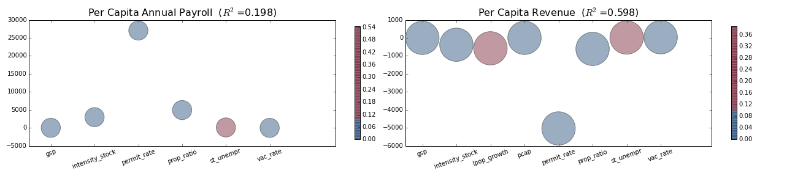

---

## LISA Models

These were intended to test the spatial dependence hypothesis directly. 

  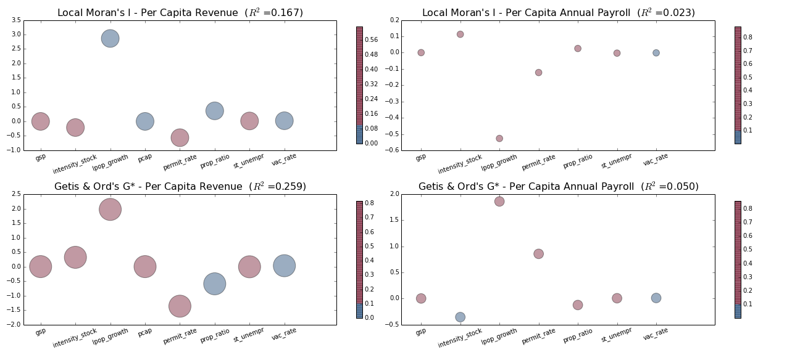

---

## Repeated Cross-Section (2SLS) - Revenue Yield

  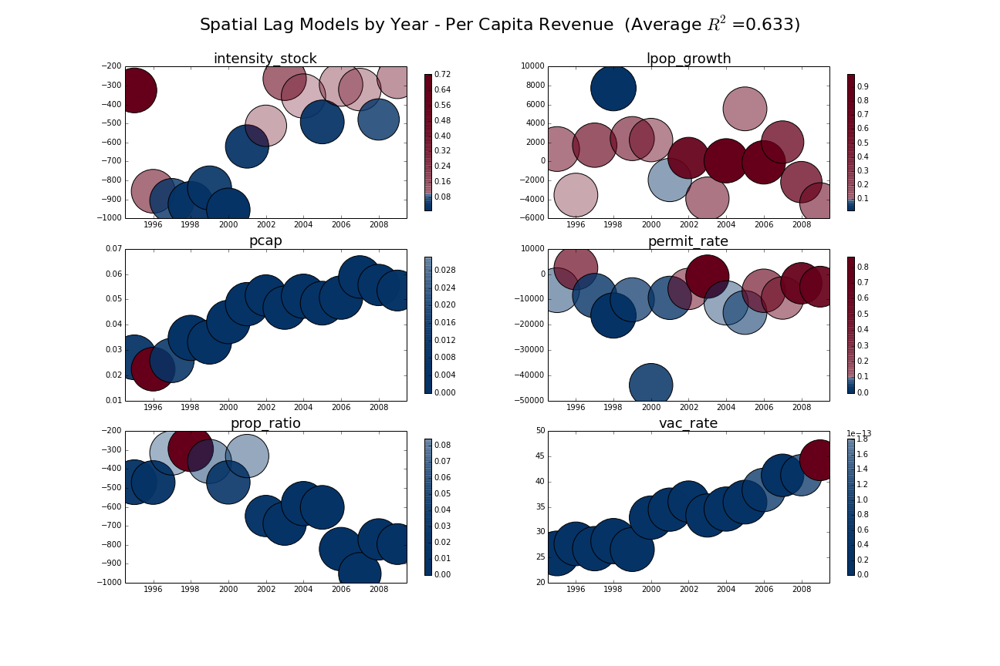

---

## Repeated Cross-Section (2SLS) - Revenue Capacity

  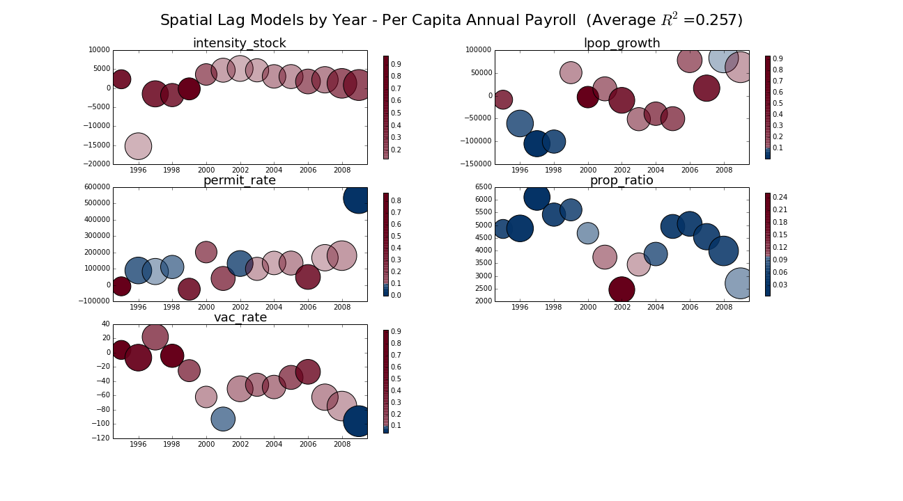

---

## Spatial Panel (ML) - Revenue Yield
### Results Summary

<TABLE border=1>
<TR> <TH>  </TH> <TH> SEM </TH> <TH> SEM_p </TH> <TH> FE </TH> <TH> FE_p </TH> <TH> FESL </TH> <TH> FESL_p </TH>  </TR>
  <TR> <TD align="right"> intensity_stock </TD> <TD align="right"> -0.44 </TD> <TD align="right"> 0.00 </TD> <TD align="right"> -0.14 </TD> <TD align="right"> 0.00 </TD> <TD align="right"> 0.05 </TD> <TD align="right"> 0.00 </TD> </TR>
  <TR> <TD align="right"> rel_prop_rat </TD> <TD align="right"> -0.10 </TD> <TD align="right"> 0.00 </TD> <TD align="right"> 0.03 </TD> <TD align="right"> 0.02 </TD> <TD align="right"> -0.06 </TD> <TD align="right"> 0.01 </TD> </TR>
  <TR> <TD align="right"> as.factor(pcap_q)1 </TD> <TD align="right"> -0.15 </TD> <TD align="right"> 0.00 </TD> <TD align="right"> 0.12 </TD> <TD align="right"> 0.00 </TD> <TD align="right"> 0.02 </TD> <TD align="right"> 0.06 </TD> </TR>
  <TR> <TD align="right"> as.factor(pcap_q)2 </TD> <TD align="right"> -0.09 </TD> <TD align="right"> 0.02 </TD> <TD align="right"> 0.19 </TD> <TD align="right"> 0.00 </TD> <TD align="right"> 0.08 </TD> <TD align="right"> 0.00 </TD> </TR>
  <TR> <TD align="right"> as.factor(pcap_q)3 </TD> <TD align="right"> 0.27 </TD> <TD align="right"> 0.00 </TD> <TD align="right"> 0.32 </TD> <TD align="right"> 0.00 </TD> <TD align="right"> 0.12 </TD> <TD align="right"> 0.00 </TD> </TR>
  <TR> <TD align="right"> as.factor(pcap_q)4 </TD> <TD align="right"> -0.02 </TD> <TD align="right"> 0.01 </TD> <TD align="right"> -0.01 </TD> <TD align="right"> 0.02 </TD> <TD align="right"> 0.27 </TD> <TD align="right"> 0.00 </TD> </TR>
  <TR> <TD align="right"> unemp_rate </TD> <TD align="right"> 0.02 </TD> <TD align="right"> 0.00 </TD> <TD align="right"> -0.00 </TD> <TD align="right"> 0.15 </TD> <TD align="right"> -0.00 </TD> <TD align="right"> 0.88 </TD> </TR>
  <TR> <TD align="right"> vac_rate </TD> <TD align="right"> -0.00 </TD> <TD align="right"> 0.00 </TD> <TD align="right"> -0.00 </TD> <TD align="right"> 0.10 </TD> <TD align="right"> -0.00 </TD> <TD align="right"> 0.43 </TD> </TR>
  <TR> <TD align="right"> pop </TD> <TD align="right"> 6.80 </TD> <TD align="right"> 0.00 </TD> <TD align="right"> 0.56 </TD> <TD align="right"> 0.00 </TD> <TD align="right"> -0.00 </TD> <TD align="right"> 0.01 </TD> </TR>
   </TABLE>

---

## Spatial Panel (ML) - Revenue Capacity
### Results Summary

<TABLE border=1>
<TR> <TH>  </TH> <TH> SEM </TH> <TH> SEM_p </TH> <TH> RE </TH> <TH> RE_p </TH> <TH> RESL </TH> <TH> RESL_p </TH> <TH> RESCE </TH> <TH> RESCE_p </TH>  </TR>
  <TR> <TD align="right"> (Intercept) </TD> <TD align="right"> 9.58 </TD> <TD align="right"> 0.00 </TD> <TD align="right"> 9.46 </TD> <TD align="right"> 0.00 </TD> <TD align="right"> 3.02 </TD> <TD align="right"> 0.00 </TD> <TD align="right"> 6.77 </TD> <TD align="right"> 0.00 </TD> </TR>
  <TR> <TD align="right"> intensity_stock </TD> <TD align="right"> 0.18 </TD> <TD align="right"> 0.01 </TD> <TD align="right"> 0.04 </TD> <TD align="right"> 0.19 </TD> <TD align="right"> 0.12 </TD> <TD align="right"> 0.00 </TD> <TD align="right"> 0.11 </TD> <TD align="right"> 0.00 </TD> </TR>
  <TR> <TD align="right"> rel_prop_rat </TD> <TD align="right"> 0.22 </TD> <TD align="right"> 0.00 </TD> <TD align="right"> -0.06 </TD> <TD align="right"> 0.27 </TD> <TD align="right"> 0.02 </TD> <TD align="right"> 0.70 </TD> <TD align="right"> -0.08 </TD> <TD align="right"> 0.17 </TD> </TR>
  <TR> <TD align="right"> unemp_rate </TD> <TD align="right"> -0.11 </TD> <TD align="right"> 0.00 </TD> <TD align="right"> -0.06 </TD> <TD align="right"> 0.00 </TD> <TD align="right"> -0.02 </TD> <TD align="right"> 0.00 </TD> <TD align="right"> -0.01 </TD> <TD align="right"> 0.00 </TD> </TR>
  <TR> <TD align="right"> vac_rate </TD> <TD align="right"> -0.00 </TD> <TD align="right"> 0.27 </TD> <TD align="right"> -0.00 </TD> <TD align="right"> 0.02 </TD> <TD align="right"> -0.00 </TD> <TD align="right"> 0.47 </TD> <TD align="right"> 0.00 </TD> <TD align="right"> 0.09 </TD> </TR>
  <TR> <TD align="right"> pop </TD> <TD align="right"> 0.00 </TD> <TD align="right"> 0.00 </TD> <TD align="right"> 0.00 </TD> <TD align="right"> 0.47 </TD> <TD align="right"> 0.00 </TD> <TD align="right"> 0.00 </TD> <TD align="right"> 0.00 </TD> <TD align="right"> 0.00 </TD> </TR>
   </TABLE>
   
---

---

## Chasing Voter Preferences

+ In controlling for the counter case, I have employed three techniques:
  + This paper sought to identify the deflections in trajectories
  + In exploring expenditure wedges, I employed unsupervised learning to typify counties

  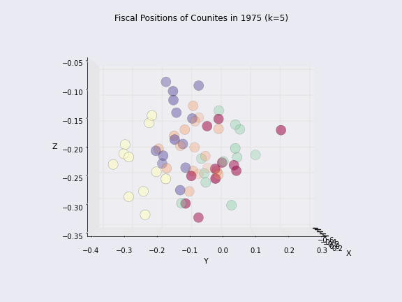

  + In controlling for the propensity for exemption, I am employ lasso regression to aid in the development of spatio-temporal instruments

  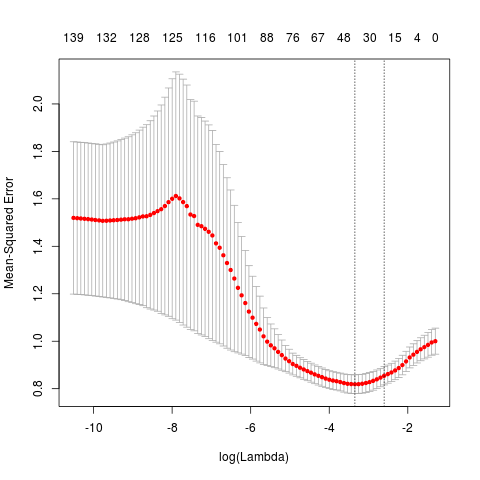
  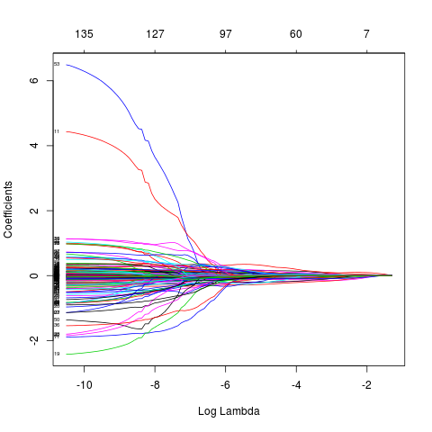

---

## Thank You For Your Attention

### What kind of reproducible research advocate would I be if I didn't share this presentation?  I will be posting it on my Github page within a few days.

## [https://github.com/choct155](https://github.com/choct155)

### Comments are more than welcome, they are encouraged.

---

## Spatial Panel (ML) - Revenue Yield
### [Spatial Error Model](http://www.inside-r.org/packages/cran/splm/docs/spml)

<TABLE border=1>
<TR> <TH>  </TH> <TH> Estimate </TH> <TH> Std. Error </TH> <TH> t-value </TH> <TH> Pr(&gt;|t|) </TH>  </TR>
  <TR> <TD align="right"> (Intercept) </TD> <TD align="right"> 6.80 </TD> <TD align="right"> 0.05 </TD> <TD align="right"> 137.25 </TD> <TD align="right"> 0.00 </TD> </TR>
  <TR> <TD align="right"> intensity_stock </TD> <TD align="right"> -0.19 </TD> <TD align="right"> 0.04 </TD> <TD align="right"> -4.97 </TD> <TD align="right"> 0.00 </TD> </TR>
  <TR> <TD align="right"> rel_prop_rat </TD> <TD align="right"> -0.44 </TD> <TD align="right"> 0.03 </TD> <TD align="right"> -15.49 </TD> <TD align="right"> 0.00 </TD> </TR>
  <TR> <TD align="right"> as.factor(pcap_q)1 </TD> <TD align="right"> -0.10 </TD> <TD align="right"> 0.03 </TD> <TD align="right"> -2.90 </TD> <TD align="right"> 0.00 </TD> </TR>
  <TR> <TD align="right"> as.factor(pcap_q)2 </TD> <TD align="right"> -0.15 </TD> <TD align="right"> 0.03 </TD> <TD align="right"> -4.34 </TD> <TD align="right"> 0.00 </TD> </TR>
  <TR> <TD align="right"> as.factor(pcap_q)3 </TD> <TD align="right"> -0.09 </TD> <TD align="right"> 0.04 </TD> <TD align="right"> -2.43 </TD> <TD align="right"> 0.02 </TD> </TR>
  <TR> <TD align="right"> as.factor(pcap_q)4 </TD> <TD align="right"> 0.27 </TD> <TD align="right"> 0.04 </TD> <TD align="right"> 6.78 </TD> <TD align="right"> 0.00 </TD> </TR>
  <TR> <TD align="right"> unemp_rate </TD> <TD align="right"> -0.02 </TD> <TD align="right"> 0.01 </TD> <TD align="right"> -2.78 </TD> <TD align="right"> 0.01 </TD> </TR>
  <TR> <TD align="right"> vac_rate </TD> <TD align="right"> 0.02 </TD> <TD align="right"> 0.00 </TD> <TD align="right"> 24.22 </TD> <TD align="right"> 0.00 </TD> </TR>
  <TR> <TD align="right"> pop </TD> <TD align="right"> -0.00 </TD> <TD align="right"> 0.00 </TD> <TD align="right"> -7.27 </TD> <TD align="right"> 0.00 </TD> </TR>
   </TABLE>
   
---

---

## Spatial Panel (ML) - Revenue Capacity
### [Spatial Error Model](http://www.inside-r.org/packages/cran/splm/docs/spml)

<TABLE border=1>
<TR> <TH>  </TH> <TH> Estimate </TH> <TH> Std. Error </TH> <TH> t-value </TH> <TH> Pr(&gt;|t|) </TH>  </TR>
  <TR> <TD align="right"> (Intercept) </TD> <TD align="right"> 9.58 </TD> <TD align="right"> 0.06 </TD> <TD align="right"> 150.21 </TD> <TD align="right"> 0.00 </TD> </TR>
  <TR> <TD align="right"> intensity_stock </TD> <TD align="right"> 0.18 </TD> <TD align="right"> 0.06 </TD> <TD align="right"> 2.73 </TD> <TD align="right"> 0.01 </TD> </TR>
  <TR> <TD align="right"> rel_prop_rat </TD> <TD align="right"> 0.22 </TD> <TD align="right"> 0.05 </TD> <TD align="right"> 4.62 </TD> <TD align="right"> 0.00 </TD> </TR>
  <TR> <TD align="right"> unemp_rate </TD> <TD align="right"> -0.11 </TD> <TD align="right"> 0.01 </TD> <TD align="right"> -11.36 </TD> <TD align="right"> 0.00 </TD> </TR>
  <TR> <TD align="right"> vac_rate </TD> <TD align="right"> -0.00 </TD> <TD align="right"> 0.00 </TD> <TD align="right"> -1.10 </TD> <TD align="right"> 0.27 </TD> </TR>
  <TR> <TD align="right"> pop </TD> <TD align="right"> 0.00 </TD> <TD align="right"> 0.00 </TD> <TD align="right"> 11.87 </TD> <TD align="right"> 0.00 </TD> </TR>
   </TABLE>

---

## Spatial Panel (ML) - Revenue Yield
### [Fixed Effects with Spatial Lag and Errors](http://www.inside-r.org/packages/cran/splm/docs/spml)

<TABLE border=1>
<TR> <TH>  </TH> <TH> Estimate </TH> <TH> Std. Error </TH> <TH> t-value </TH> <TH> Pr(&gt;|t|) </TH>  </TR>
  <TR> <TD align="right"> lambda </TD> <TD align="right"> 0.74 </TD> <TD align="right"> 0.05 </TD> <TD align="right"> 16.32 </TD> <TD align="right"> 0.00 </TD> </TR>
  <TR> <TD align="right"> rho </TD> <TD align="right"> -0.66 </TD> <TD align="right"> 0.11 </TD> <TD align="right"> -5.95 </TD> <TD align="right"> 0.00 </TD> </TR>
  <TR> <TD align="right"> intensity_stock </TD> <TD align="right"> 0.05 </TD> <TD align="right"> 0.01 </TD> <TD align="right"> 3.95 </TD> <TD align="right"> 0.00 </TD> </TR>
  <TR> <TD align="right"> rel_prop_rat </TD> <TD align="right"> -0.06 </TD> <TD align="right"> 0.02 </TD> <TD align="right"> -2.76 </TD> <TD align="right"> 0.01 </TD> </TR>
  <TR> <TD align="right"> as.factor(pcap_q)1 </TD> <TD align="right"> 0.02 </TD> <TD align="right"> 0.01 </TD> <TD align="right"> 1.91 </TD> <TD align="right"> 0.06 </TD> </TR>
  <TR> <TD align="right"> as.factor(pcap_q)2 </TD> <TD align="right"> 0.08 </TD> <TD align="right"> 0.02 </TD> <TD align="right"> 4.89 </TD> <TD align="right"> 0.00 </TD> </TR>
  <TR> <TD align="right"> as.factor(pcap_q)3 </TD> <TD align="right"> 0.12 </TD> <TD align="right"> 0.02 </TD> <TD align="right"> 6.56 </TD> <TD align="right"> 0.00 </TD> </TR>
  <TR> <TD align="right"> as.factor(pcap_q)4 </TD> <TD align="right"> 0.27 </TD> <TD align="right"> 0.03 </TD> <TD align="right"> 10.94 </TD> <TD align="right"> 0.00 </TD> </TR>
  <TR> <TD align="right"> unemp_rate </TD> <TD align="right"> -0.00 </TD> <TD align="right"> 0.00 </TD> <TD align="right"> -0.16 </TD> <TD align="right"> 0.88 </TD> </TR>
  <TR> <TD align="right"> vac_rate </TD> <TD align="right"> -0.00 </TD> <TD align="right"> 0.00 </TD> <TD align="right"> -0.79 </TD> <TD align="right"> 0.43 </TD> </TR>
  <TR> <TD align="right"> pop </TD> <TD align="right"> -0.00 </TD> <TD align="right"> 0.00 </TD> <TD align="right"> -2.62 </TD> <TD align="right"> 0.01 </TD> </TR>
   </TABLE>

---

## Spatial Panel (ML) - Revenue Capacity
### [Random Effects with Spatial Lag and Errors](http://www.inside-r.org/packages/cran/splm/docs/spml)

<TABLE border=1>
<TR> <TH>  </TH> <TH> Estimate </TH> <TH> Std. Error </TH> <TH> t-value </TH> <TH> Pr(&gt;|t|) </TH>  </TR>
  <TR> <TD align="right"> (Intercept) </TD> <TD align="right"> 3.02 </TD> <TD align="right"> 0.08 </TD> <TD align="right"> 36.61 </TD> <TD align="right"> 0.00 </TD> </TR>
  <TR> <TD align="right"> intensity_stock </TD> <TD align="right"> 0.12 </TD> <TD align="right"> 0.02 </TD> <TD align="right"> 5.43 </TD> <TD align="right"> 0.00 </TD> </TR>
  <TR> <TD align="right"> rel_prop_rat </TD> <TD align="right"> 0.02 </TD> <TD align="right"> 0.04 </TD> <TD align="right"> 0.38 </TD> <TD align="right"> 0.70 </TD> </TR>
  <TR> <TD align="right"> unemp_rate </TD> <TD align="right"> -0.02 </TD> <TD align="right"> 0.00 </TD> <TD align="right"> -5.80 </TD> <TD align="right"> 0.00 </TD> </TR>
  <TR> <TD align="right"> vac_rate </TD> <TD align="right"> -0.00 </TD> <TD align="right"> 0.00 </TD> <TD align="right"> -0.72 </TD> <TD align="right"> 0.47 </TD> </TR>
  <TR> <TD align="right"> pop </TD> <TD align="right"> 0.00 </TD> <TD align="right"> 0.00 </TD> <TD align="right"> 3.97 </TD> <TD align="right"> 0.00 </TD> </TR>
   </TABLE>
   
---

---

## Spatial Panel (ML) - Revenue Capacity
### [Random Effects with Spatial Lag and Serially Correlated Errors](http://www.inside-r.org/packages/cran/splm/docs/spreml)

<TABLE border=1>
<TR> <TH>  </TH> <TH> Estimate </TH> <TH> Std. Error </TH> <TH> t-value </TH> <TH> Pr(&gt;|t|) </TH>  </TR>
  <TR> <TD align="right"> (Intercept) </TD> <TD align="right"> 6.77 </TD> <TD align="right"> 0.09 </TD> <TD align="right"> 73.83 </TD> <TD align="right"> 0.00 </TD> </TR>
  <TR> <TD align="right"> intensity_stock </TD> <TD align="right"> 0.11 </TD> <TD align="right"> 0.04 </TD> <TD align="right"> 3.09 </TD> <TD align="right"> 0.00 </TD> </TR>
  <TR> <TD align="right"> rel_prop_rat </TD> <TD align="right"> -0.08 </TD> <TD align="right"> 0.05 </TD> <TD align="right"> -1.38 </TD> <TD align="right"> 0.17 </TD> </TR>
  <TR> <TD align="right"> unemp_rate </TD> <TD align="right"> -0.01 </TD> <TD align="right"> 0.00 </TD> <TD align="right"> -4.88 </TD> <TD align="right"> 0.00 </TD> </TR>
  <TR> <TD align="right"> vac_rate </TD> <TD align="right"> 0.00 </TD> <TD align="right"> 0.00 </TD> <TD align="right"> 1.67 </TD> <TD align="right"> 0.09 </TD> </TR>
  <TR> <TD align="right"> pop </TD> <TD align="right"> 0.00 </TD> <TD align="right"> 0.00 </TD> <TD align="right"> 4.03 </TD> <TD align="right"> 0.00 </TD> </TR>
   </TABLE>

